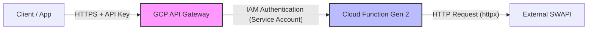

# Star Wars API Proxy (Serverless + API Gateway) 🚀

A high-performance, secure Serverless API built to query, filter, sort, and paginate data from the Star Wars universe. It acts as an intelligent, authenticated proxy for the [SWAPI](https://swapi.dev/).


## 🏗️ Technical Architecture

This project implements a **Secure Serverless Architecture** on Google Cloud Platform, ensuring that the backend logic is protected and accessible only via authorized entry points.

### Architecture Diagram



### Components

1.  **API Gateway:** Acts as the single entry point ("Front Door"). It manages traffic, handles SSL, and enforces **API Key Authentication**.
2.  **Cloud Function (Gen 2):** Hosts the Python application logic. Direct public access is **disabled** (`--no-allow-unauthenticated`). It only accepts requests from the Gateway's Service Account via IAM permissions.
3.  **Clean Architecture:**
    * **Controller:** HTTP handling & Validation.
    * **Service:** Business Logic (Sorting, Filtering, Pagination).
    * **Client:** External data fetching.

---

## 🌟 Features

This proxy adds **superpowers** to the raw SWAPI data:

| Feature         |    Original SWAPI     |                This Proxy API                |
|:----------------|:---------------------:|:--------------------------------------------:|
| **Security**    |        Public         |           🔒 **API Key Protected**           |
| **Search**      |        Limited        |   ✅ **Partial Search** (Case Insensitive)    |
| **Sorting**     |    ❌ Not supported    | ✅ **Dynamic Sorting** (e.g., by Name, Title) |
| **Pagination**  |   Fixed (10 items)    |    ✅ **Customizable** (`page` and `size`)    |
| **Performance** | Slower (Page walking) |     ⚡ **Fast** (In-memory consolidation)     |

---

## 🚀 API Usage

**Base URL:**
`https://starwars-gateway-42dgaxj9.uc.gateway.dev`

**Authentication:**
All requests must include a valid Google Cloud API Key via the `key` query parameter.

### Supported Parameters

| Parameter | Description                                                           | Default  | Example           |
|:----------|:----------------------------------------------------------------------|:---------|:------------------|
| `type`    | Resource type (`people`, `films`, `planets`, `starships`, `vehicles`) | `people` | `type=planets`    |
| `key`     | **Required.** Your Google Cloud API Key.                              | -        | `key=AIzaSy...`   |
| `filter`  | Term for text search (names or titles)                                | `None`   | `filter=tatooine` |
| `sort`    | Field key to sort the results by                                      | `None`   | `sort=name`       |
| `page`    | Page number                                                           | `1`      | `page=2`          |
| `size`    | Number of items per page                                              | `10`     | `size=20`         |

### Examples

#### 1. List Films Sorted by Title (A-Z)
```bash
curl -s 'https://starwars-gateway-42dgaxj9.uc.gateway.dev?type=films&sort=title&key=YOUR_API_KEY'
```

#### 2. Search for a Person (Case Insensitive)
Finds "Luke", "luke", or "LUKE".
```bash
curl -s 'https://starwars-gateway-42dgaxj9.uc.gateway.dev?type=people&filter=Skywalker&key=YOUR_API_KEY'
```

#### 3. Custom Pagination for Starships
Get page 2, displaying 5 starships per page.
```bash
curl -s 'https://starwars-gateway-42dgaxj9.uc.gateway.dev?type=starships&page=2&size=5&key=YOUR_API_KEY'
```

---

## 💻 Local Development

This project uses **uv** for dependency management and **pytest** for testing.

### Prerequisites
* Python 3.11+
* `uv` (Universal Python Package Manager)

### Installation
```bash
# Install dependencies
uv sync
```

### Running Tests
The project has comprehensive unit tests covering Client, Service, and Controller layers.
```bash
uv run pytest
```

---

## ☁️ Deployment & CI/CD

The deployment pipeline is automated using **GitHub Actions**.

### ⚠️ Architectural Decision Record (ADR): CI/CD Authentication
Ideally, this project would use **Workload Identity Federation (WIF)**. However, due to a persistent platform error (`INVALID_ARGUMENT`) encountered in the specific GCP project environment, we opted to use **Service Account Keys (JSON)** stored in GitHub Secrets to ensure pipeline stability.

### Manual Deployment Commands

**1. Cloud Function (Backend):**
Note the usage of `--no-allow-unauthenticated` to ensure security.
```bash
gcloud functions deploy starwars-function \
  --gen2 \
  --runtime=python311 \
  --region=us-central1 \
  --source=. \
  --entry-point=hello_http \
  --trigger-http \
  --no-allow-unauthenticated
```

**2. API Gateway (Frontend):**
```bash
gcloud api-gateway api-configs create starwars-config-v3 \
  --api=starwars-api --openapi-spec=openapi-spec.yaml ...

gcloud api-gateway gateways update starwars-gateway \
  --api=starwars-api --api-config=starwars-config-v3 ...
```

---

## 📂 Project Structure

```text
.
├── .github/workflows/       # CI/CD Pipelines
│   └── deploy.yml           # GitHub Actions Deployment
├── model/                   # Data Models (Type Hinting)
│   ├── films.py
│   ├── person.py
│   ├── planet.py
│   └── ...
├── tests/                   # Unit Tests
├── main.py                  # Cloud Function Entrypoint
├── starwars_controller.py   # HTTP & Validation Layer
├── starwars_service.py      # Business Logic Layer
├── swapi_client.py          # Data Access Layer
├── openapi-spec.yaml        # API Gateway Configuration (OpenAPI 2.0)
├── pyproject.toml           # Dev dependencies & config
├── requirements.txt         # Production dependencies
└── README.md                # Documentation
```

---
*Developed as part of the Android/Kotlin Backend Layer Technical Challenge.*