# Star Wars API Proxy (Serverless + API Gateway) 🚀

A high-performance, secure Serverless API built to query, filter, sort, and paginate data from the Star Wars universe. It acts as an intelligent, authenticated proxy for the [SWAPI](https://swapi.dev/).


## 🏗️ Technical Architecture

This project implements a **Secure Serverless Architecture** on Google Cloud Platform. It ensures backend logic is protected and accessible only via authorized entry points.

### Architecture Diagram

```mermaid
%%{init: {'theme': 'base', 'themeVariables': { 'primaryColor': '#e8f0fe', 'edgeLabelBackground':'#ffffff', 'tertiaryColor': '#fff'}, 'flowchart': {'curve': 'basis', 'nodeSpacing': 50, 'rankSpacing': 80, 'padding': 20}} }%%

graph TD
    classDef client fill:#ffffff,stroke:#333,stroke-width:2px,color:#000,rx:10,ry:10;
    classDef gcp fill:#e8f0fe,stroke:#4285F4,stroke-width:2px,color:#1a73e8,rx:5,ry:5;
    classDef external fill:#fff3e0,stroke:#ff9800,stroke-width:2px,color:#e65100,rx:5,ry:5;

    Client([&nbsp;&nbsp;👤 Client / App&nbsp;&nbsp;<br/>Browser or Mobile])
    
    subgraph Cloud [☁️ Google Cloud Platform - Secure Zone]
    direction TB
    
    Gateway["&nbsp;&nbsp;🛡️ API Gateway&nbsp;&nbsp;<br/>(Auth Check & Routing)"]
    Function["&nbsp;&nbsp;⚡ Cloud Function Gen 2&nbsp;&nbsp;<br/>(Controller + Service + Logic)"]
    
    Gateway -. "✅ IAM Authorized<br/>(Service Account)" .-> Function
    end
    
    SWAPI[("&nbsp;&nbsp;💾 External SWAPI&nbsp;&nbsp;<br/>(Raw Data Source)")]
    
    Client --> |"<p style=padding:10px;background:#fff3e0;>1. HTTPS Request<br/>(with ?key=API_KEY)<p>"| Gateway
    Function <==> |"<p style=padding:10px;background:#fff3e0;>2. Fetch & Process Data<br/>(httpx)<p>"| SWAPI
    
    class Client client;
    class Gateway,Function gcp;
    class SWAPI external;
    
    style Cloud fill:#f8faff,stroke:#aecbfa,stroke-width:2px
```



### Components

1.  **API Gateway:** Acts as the single entry point ("Front Door"). It manages traffic, handles SSL, and enforces **API Key Authentication**.
2.  **Cloud Function (Gen 2):** Hosts the Python application logic. Direct public access is **disabled** (`--no-allow-unauthenticated`). It only accepts requests from the Gateway's Service Account via IAM permissions.
3.  **Clean Architecture:**
    * **Controller:** HTTP handling & Validation (Environment aware).
    * **Service:** Business Logic (Data Correlation, Sorting, Filtering, Pagination).
    * **Client:** External data fetching.

---

## 🌟 Features

This proxy adds **superpowers** to the raw SWAPI data:

| Feature         |    Original SWAPI     |                   This Proxy API                    |
|:----------------|:---------------------:|:---------------------------------------------------:|
| **Security**    |        Public         |              🔒 **API Key Protected**               |
| **Correlation** |     Manual Links      | ✅ **Deep Filtering** (e.g., Get Characters by Film) |
| **Search**      |        Limited        |       ✅ **Partial Search** (Case Insensitive)       |
| **Sorting**     |    ❌ Not supported    |    ✅ **Dynamic Sorting** (e.g., by Name, Title)     |
| **Pagination**  |   Fixed (10 items)    |       ✅ **Customizable** (`page` and `size`)        |
| **Performance** | Slower (Page walking) |        ⚡ **Fast** (In-memory consolidation)         |

---

## 🚀 Production Usage (Cloud)

When deployed, the API is accessed via the **API Gateway** URL.

**Base URL:**
`https://starwars-gateway-42dgaxj9.uc.gateway.dev`

**Authentication:**
All requests must include a valid Google Cloud API Key via the `key` query parameter.

### Supported Parameters

| Parameter | Description                                                      | Default  | Example           |
|:----------|:-----------------------------------------------------------------|:---------|:------------------|
| `type`    | Resource (`people`, `films`, `planets`, `starships`, `vehicles`) | `people` | `type=planets`    |
| `key`     | **Required.** Your Google Cloud API Key.                         | -        | `key=AIzaSy...`   |
| `film_id` | **New!** Filter resources that appeared in a specific film ID.   | `None`   | `film_id=1`       |
| `filter`  | Term for text search (names or titles)                           | `None`   | `filter=tatooine` |
| `sort`    | Field key to sort the results by                                 | `None`   | `sort=name`       |
| `page`    | Page number                                                      | `1`      | `page=2`          |
| `size`    | Number of items per page                                         | `10`     | `size=20`         |

### Examples (cURL)

#### 1. List Films Sorted by Title (A-Z)
```bash
curl -s 'https://starwars-gateway-42dgaxj9.uc.gateway.dev?type=films&sort=title&key=YOUR_API_KEY'
```

#### 2. Search for a Person (Case Insensitive)
Finds "Luke", "luke", or "LUKE".
```bash
curl -s 'https://starwars-gateway-42dgaxj9.uc.gateway.dev?type=people&filter=Skywalker&key=YOUR_API_KEY'
```

#### 3. Deep Correlation: Get Characters from "A New Hope"
Fetches all `people` resources that appeared in Film ID 1.
```bash
curl -s 'https://starwars-gateway-42dgaxj9.uc.gateway.dev?type=people&film_id=1&key=YOUR_API_KEY'
```

---

## 💻 Local Development & Testing

This project uses **uv** for dependency management. To simulate the Google Cloud environment locally, we use the **Functions Framework**.

### 1. Setup Environment
```bash
# Install dependencies
uv sync
```

### 2. Configure Local Variables (.env)
Create a `.env` file to define your local base URL. This ensures the API generates correct links (HATEOAS) when running on your machine.
```bash
cp .env.example .env
```
*Make sure `.env` contains: `BASE_URL=http://127.0.0.1:8080`*

### 3. Run Local Server
Start the function locally on port 8080:
```bash
uv run functions-framework --target=hello_http --debug --port=8080
```

### 4. Run Local Tests
Open a new terminal and test without an API Key (Authentication is handled by Gateway, so it's bypassed locally):
```bash
# Test connection
curl "http://localhost:8080?type=people&name=luke"

# Run Unit Tests
uv run pytest
```

---

## ☁️ Deployment & CI/CD

The deployment pipeline is automated using **GitHub Actions**.

### ⚠️ Architectural Decision Record (ADR): CI/CD Authentication
Ideally, this project would use **Workload Identity Federation (WIF)**. However, due to a persistent platform error (`INVALID_ARGUMENT`) encountered in the specific GCP project environment, we opted to use **Service Account Keys (JSON)** stored in GitHub Secrets to ensure pipeline stability.

### Manual Deployment Commands

**1. Cloud Function (Backend):**
Note the usage of `--no-allow-unauthenticated` to ensure security and the environment variable injection.
```bash
gcloud functions deploy starwars-function \
  --gen2 \
  --runtime=python311 \
  --region=us-central1 \
  --source=. \
  --entry-point=hello_http \
  --trigger-http \
  --no-allow-unauthenticated \
  --set-env-vars BASE_URL=${BASE_URL}
```

**2. API Gateway (Frontend):**
```bash
gcloud api-gateway api-configs create starwars-config-v3 \
  --api=starwars-api --openapi-spec=openapi-spec.yaml ...

gcloud api-gateway gateways update starwars-gateway \
  --api=starwars-api --api-config=starwars-config-v3 ...
```

---

## 📂 Project Structure

```bash
.
├── .github/workflows/       # CI/CD Pipelines
│   └── deploy.yml           # GitHub Actions Deployment
├── model/                   # Data Models (Type Hinting)
│   ├── films.py
│   ├── person.py
│   └── ...
├── tests/                   # Unit Tests
├── .env                     # Local configuration (GitIgnored)
├── .env.example             # Example configuration
├── main.py                  # Cloud Function Entrypoint
├── starwars_controller.py   # HTTP & Validation Layer (Env Aware)
├── starwars_service.py      # Business Logic Layer
├── swapi_client.py          # Data Access Layer
├── openapi-spec.yaml        # API Gateway Configuration (OpenAPI 2.0)
├── pyproject.toml           # Dev dependencies & config
├── requirements.txt         # Production dependencies
└── README.md                # Documentation
```

---
*Developed as part of the Android/Kotlin Backend Layer Technical Challenge.*